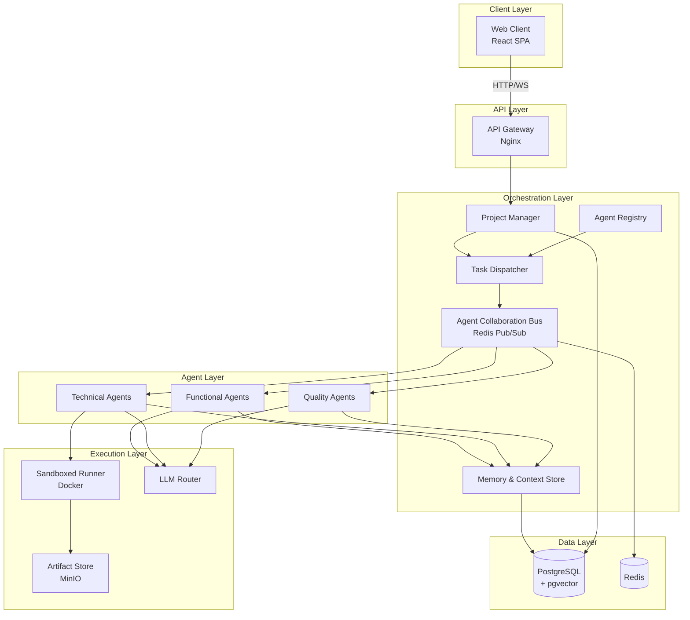

# Werk Platform — System Architecture Design

## Overview

Werk is an AI-orchestrated platform where specialized functional consulting agents (Requirements, UX, Business Logic) collaborate seamlessly with technical agents (Architecture, Coding, Testing) to build and deploy high-quality software at scale.

This document covers the high-level system architecture, chosen tech stack, agent orchestration layer, and deployment topology.

---

## 1. High-Level System Architecture

```
┌─────────────────────────────────────────────────────────────────────┐
│                          WEB CLIENT (Browser)                       │
│                    React SPA  ←→  Werk Dashboard                    │
└───────────────────────────┬─────────────────────────────────────────┘
                            │ HTTPS / WebSocket
                            ▼
┌─────────────────────────────────────────────────────────────────────┐
│                      API GATEWAY (Nginx / Traefik)                   │
│       Routes: /api/* → Backend  |  /ws/* → Orchestrator WS          │
└───────────────────────────┬─────────────────────────────────────────┘
                            │
                            ▼
┌──────────────────────────────────────────────────────────────────────┐
│                     WERK ORCHESTRATION LAYER                         │
│                                                                      │
│  ┌────────────┐  ┌────────────┐  ┌────────────┐  ┌──────────────┐   │
│  │  Project   │  │   Agent    │  │   Task     │  │   Memory &    │   │
│  │  Manager   │  │  Registry  │  │  Dispatcher│  │ Context Store │   │
│  └────────────┘  └────────────┘  └────────────┘  └──────────────┘   │
│                                                                      │
│  ┌──────────────────────────────────────────────────────────────┐   │
│  │              AGENT COLLABORATION BUS (Pub/Sub)               │   │
│  │  Events: task.assigned | artifact.created | review.needed    │   │
│  └──────────────────────────────────────────────────────────────┘   │
└───────────────────────────┬──────────────────────────────────────────┘
                            │
          ┌─────────────────┼─────────────────┐
          ▼                 ▼                   ▼
┌─────────────────┐ ┌─────────────────┐ ┌─────────────────┐
│  FUNCTIONAL     │ │  TECHNICAL      │ │  QUALITY        │
│  AGENTS         │ │  AGENTS         │ │  AGENTS         │
│                 │ │                 │ │                 │
│ • Requirements  │ │ • Architect     │ │ • Tester        │
│ • UX Designer   │ │ • Developer     │ │ • Reviewer      │
│ • Business Anal.│ │ • DevOps        │ │ • Security      │
└─────────────────┘ └─────────────────┘ └─────────────────┘
                            │
                            ▼
┌──────────────────────────────────────────────────────────────────────┐
│                      EXECUTION ENVIRONMENT                           │
│                                                                      │
│  ┌──────────────────┐  ┌─────────────────┐  ┌──────────────────┐    │
│  │   Sandboxed      │  │  Artifact       │  │  LLM Router      │    │
│  │   Runner (Docker)│  │  Store (S3/minio)│  │  (OpenAI/Anthropic)│   │
│  └──────────────────┘  └─────────────────┘  └──────────────────┘    │
│                                                                      │
│  ┌──────────────────┐  ┌─────────────────┐                           │
│  │   Database       │  │  Git Integration │                           │
│  │   (PostgreSQL)   │  │  (GitHub API)    │                           │
│  └──────────────────┘  └─────────────────┘                           │
└──────────────────────────────────────────────────────────────────────┘
```

### Component Responsibilities

| Component | Responsibility |
|---|---|
| **Project Manager** | Orchestrates project lifecycle: init → planning → execution → review → delivery |
| **Agent Registry** | Catalog of available agents with capabilities, LLM configs, and status |
| **Task Dispatcher** | Assigns tasks to agents based on capability matching and load balancing |
| **Memory & Context Store** | Shared context across agents for a project: decisions, artifacts, conversation history |
| **Agent Collaboration Bus** | Event-driven message bus enabling agents to communicate asynchronously |
| **Sandboxed Runner** | Isolated execution environment for code generation, testing, and deployment |
| **LLM Router** | Routes prompts to appropriate LLM providers/models based on task type |

---

## 2. Tech Stack

### Frontend
| Layer | Technology | Rationale |
|---|---|---|
| Framework | **React 18+ with TypeScript** | Mature ecosystem, strong typing, component reusability |
| Build Tool | **Vite** | Fast HMR, lightweight (memory-friendly) |
| State Management | **Zustand** | Minimal boilerplate, excellent TypeScript support |
| UI Components | **Tailwind CSS + Radix UI** | Utility-first styling + accessible primitives |
| Real-time | **WebSocket (native)** | Agent collaboration bus communication |

### Backend
| Layer | Technology | Rationale |
|---|---|---|
| API Framework | **FastAPI (Python)** | Async-native, automatic OpenAPI docs, excellent for AI/LLM workloads |
| Orchestration | **Celery + Redis** | Task queue for long-running agent operations |
| WebSockets | **FastAPI WebSocket + Redis Pub/Sub** | Real-time agent communication |
| Auth | **JWT + OAuth2** | Stateless authentication |

### Database & Storage
| Layer | Technology | Rationale |
|---|---|---|
| Primary DB | **PostgreSQL 16** | ACID compliance, JSONB for flexible agent state, excellent with async drivers |
| Cache / Queue | **Redis** | Pub/sub for agent bus, task queue backend, session cache |
| File Storage | **MinIO (S3-compatible)** | Artifact storage: PRDs, designs, code, test reports |
| Vector Store | **pgvector (PostgreSQL extension)** | Semantic search across project context and agent memory |

### Infrastructure
| Layer | Technology | Rationale |
|---|---|---|
| Containerization | **Docker + Docker Compose** | Consistent dev environments, sandboxed runners |
| CI/CD | **GitHub Actions** | Tight GitHub integration, matrix builds |
| Monitoring | **Prometheus + Grafana** | Metrics for KPI tracking (Cycle Time, Autonomy Score) |
| Reverse Proxy | **Nginx** | API gateway, rate limiting, TLS termination |

### AI / LLM
| Service | Provider | Use Case |
|---|---|---|
| Primary LLM | **OpenAI GPT-4o** | Complex reasoning, code generation, architecture decisions |
| Secondary LLM | **Anthropic Claude 3.5 Sonnet** | UX design, documentation, safety checks |
| Embeddings | **OpenAI text-embedding-3-small** | Context retrieval, semantic search |
| Code Sandbox | **Docker-in-Docker** | Safe code execution and testing |

---

## 3. Agent Orchestration Layer Design

### 3.1 Agent Types

#### Functional Agents
| Agent | Capabilities | Outputs |
|---|---|---|
| **Requirements Agent** | User story writing, PRD generation, acceptance criteria | PRD.md, stories.md |
| **UX Agent** | Wireframes, user flows, design systems | wireframes/, designs/ |
| **Business Logic Agent** | Data models, business rules, validation logic | models/, logic/ |

#### Technical Agents
| Agent | Capabilities | Outputs |
|---|---|---|
| **Architect Agent** | System design, tech selection, schema design | architecture.md, schema.sql |
| **Developer Agent** | Code generation, implementation, refactoring | src/ files |
| **Tester Agent** | Unit tests, integration tests, E2E tests | test/ files |
| **DevOps Agent** | CI/CD configs, Dockerfiles, deployment scripts | .github/, Dockerfile |

### 3.2 Agent Communication Protocol

All agents communicate via an event-driven message bus:

```
Agent → [Event Bus] → Other Agents
```

**Event Types:**
- `task.assigned` — Agent receives a new task
- `artifact.created` — Agent produces an artifact (file, diagram, code)
- `review.needed` — Agent requests review from another agent type
- `review.approved` / `review.rejected` — Review outcome
- `context.updated` — Shared context has changed (e.g., requirements updated)
- `blocker.raised` — Agent encounters a blocker requiring human intervention

### 3.3 Orchestration Flow

```
1. Project Init
   └── Requirements Agent creates PRD → artifact.created

2. UX Design
   └── UX Agent reads PRD → creates wireframes → review.needed for Requirements Agent

3. Architecture
   └── Architect Agent reads PRD + wireframes → creates architecture design

4. Development
   └── Developer Agent reads architecture → implements code → artifact.created

5. Testing
   └── Tester Agent reads code → creates tests → review.needed for Developer Agent

6. Review & Approval
   └── All artifacts reviewed → review.approved → handoff to DevOps

7. Deployment
   └── DevOps Agent packages and deploys → artifact.created (deployment URL)
```

### 3.4 Agent Collaboration Bus Architecture

```
┌─────────────────────────────────────────────────┐
│              Redis Pub/Sub Channels              │
│                                                   │
│  channel: werk:project:{id}:tasks                 │
│  channel: werk:project:{id}:artifacts             │
│  channel: werk:project:{id}:reviews               │
│  channel: werk:project:{id}:blockers              │
│  channel: werk:project:{id}:context               │
│                                                   │
│  Each agent subscribes to relevant channels       │
│  and publishes events as they work                │
└─────────────────────────────────────────────────┘
```

---

## 4. Database Schema (PostgreSQL)

### Core Tables

```sql
-- Projects
CREATE TABLE projects (
    id UUID PRIMARY KEY DEFAULT gen_random_uuid(),
    name TEXT NOT NULL,
    description TEXT,
    status TEXT NOT NULL DEFAULT 'draft',  -- draft, active, completed, archived
    config JSONB DEFAULT '{}',
    created_at TIMESTAMPTZ DEFAULT NOW(),
    updated_at TIMESTAMPTZ DEFAULT NOW()
);

-- Agents Registry
CREATE TABLE agents (
    id UUID PRIMARY KEY DEFAULT gen_random_uuid(),
    name TEXT NOT NULL,
    type TEXT NOT NULL,  -- functional, technical, quality
    role TEXT NOT NULL,  -- requirements, ux, business, architect, developer, tester, devops
    llm_config JSONB DEFAULT '{}',  -- model, temperature, etc.
    capabilities JSONB DEFAULT '[]',
    status TEXT DEFAULT 'idle',  -- idle, busy, offline
    created_at TIMESTAMPTZ DEFAULT NOW()
);

-- Tasks
CREATE TABLE tasks (
    id UUID PRIMARY KEY DEFAULT gen_random_uuid(),
    project_id UUID REFERENCES projects(id),
    title TEXT NOT NULL,
    description TEXT,
    status TEXT NOT NULL DEFAULT 'backlog',  -- backlog, in_progress, review, done, blocked
    assigned_agent_id UUID REFERENCES agents(id),
    parent_task_id UUID REFERENCES tasks(id),
    priority INTEGER DEFAULT 0,
    artifacts JSONB DEFAULT '[]',
    result TEXT,
    created_at TIMESTAMPTZ DEFAULT NOW(),
    updated_at TIMESTAMPTZ DEFAULT NOW()
);

-- Artifacts
CREATE TABLE artifacts (
    id UUID PRIMARY KEY DEFAULT gen_random_uuid(),
    project_id UUID REFERENCES projects(id),
    task_id UUID REFERENCES tasks(id),
    agent_id UUID REFERENCES agents(id),
    file_path TEXT NOT NULL,
    file_type TEXT,  -- md, code, image, diagram
    metadata JSONB DEFAULT '{}',
    created_at TIMESTAMPTZ DEFAULT NOW()
);

-- Agent Communication Log
CREATE TABLE agent_events (
    id UUID PRIMARY KEY DEFAULT gen_random_uuid(),
    project_id UUID REFERENCES projects(id),
    event_type TEXT NOT NULL,  -- task.assigned, artifact.created, etc.
    source_agent_id UUID REFERENCES agents(id),
    target_agent_id UUID REFERENCES agents(id),
    payload JSONB DEFAULT '{}',
    created_at TIMESTAMPTZ DEFAULT NOW()
);

-- Project Context (Shared Memory)
CREATE TABLE context_entries (
    id UUID PRIMARY KEY DEFAULT gen_random_uuid(),
    project_id UUID REFERENCES projects(id),
    agent_id UUID REFERENCES agents(id),
    key TEXT NOT NULL,
    value JSONB NOT NULL,
    version INTEGER DEFAULT 1,
    created_at TIMESTAMPTZ DEFAULT NOW(),
    updated_at TIMESTAMPTZ DEFAULT NOW(),
    UNIQUE(project_id, key)
);
```

### Indexes
```sql
CREATE INDEX idx_tasks_project_status ON tasks(project_id, status);
CREATE INDEX idx_tasks_assigned_agent ON tasks(assigned_agent_id, status);
CREATE INDEX idx_artifacts_project ON artifacts(project_id);
CREATE INDEX idx_agent_events_project ON agent_events(project_id, created_at);
CREATE INDEX idx_context_project ON context_entries(project_id, key);
```

---

## 5. Deployment Architecture

```
                    ┌──────────────────────┐
                    │   Load Balancer       │
                    │   (Nginx)             │
                    └──────┬───────────────┘
                           │
          ┌────────────────┼────────────────┐
          ▼                ▼                 ▼
   ┌────────────┐   ┌────────────┐   ┌────────────┐
   │  Web App   │   │  API       │   │  WS        │
   │  (React)   │   │  (FastAPI) │   │  Server    │
   └────────────┘   └─────┬──────┘   └─────┬──────┘
                          │                 │
                          ▼                 │
                   ┌────────────┐           │
                   │  Celery    │           │
                   │  Workers   │           │
                   └─────┬──────┘           │
                         │                  │
                         ▼                  ▼
                  ┌─────────────────────────────┐
                  │        Redis (Pub/Sub)       │
                  └─────────────┬───────────────┘
                               │
                               ▼
                  ┌─────────────────────────────┐
                  │      PostgreSQL (+ pgvector) │
                  └─────────────────────────────┘
                               │
                               ▼
                  ┌─────────────────────────────┐
                  │    MinIO (Artifact Store)    │
                  └─────────────────────────────┘
```

---

## 6. KPI Measurement Points

| KPI | Measurement Point | Data Source |
|---|---|---|
| **Cycle Time** | Time from first task creation to deployment artifact | `tasks.created_at` to `artifacts.created_at` where file_type='deployment' |
| **Agent Autonomy Score** | % tasks completed without human intervention | `agent_events` where event_type NOT LIKE '%human%' / total events |
| **CSAT** | User feedback survey | External survey submitted manually |

---

## 7. Repository Structure

```
werk/
├── frontend/              # React + Vite SPA
│   ├── src/
│   │   ├── components/    # UI components
│   │   ├── pages/         # Route pages
│   │   ├── stores/        # Zustand stores
│   │   └── ws/            # WebSocket client
│   ├── package.json
│   └── vite.config.ts
│
├── backend/               # FastAPI backend
│   ├── app/
│   │   ├── api/           # REST endpoints
│   │   ├── core/          # Config, auth, middleware
│   │   ├── models/        # SQLAlchemy models
│   │   ├── services/      # Business logic
│   │   └── agents/        # Agent implementations
│   ├── requirements.txt
│   └── Dockerfile
│
├── orchestrator/          # Agent orchestration engine
│   ├── bus/               # Event bus (Redis Pub/Sub)
│   ├── dispatcher/        # Task dispatching logic
│   ├── memory/            # Context store management
│   └── registry/          # Agent registry service
│
├── infrastructure/        # Docker, CI/CD, configs
│   ├── docker-compose.yml
│   ├── nginx/
│   └── monitoring/
│
└── docs/                  # Architecture & design docs
    └── architecture.md
```

---

## 8. Mermaid Architecture Diagram



---

## 9. Key Design Decisions

1. **Event-driven architecture** — Agents communicate asynchronously via Redis Pub/Sub, enabling loose coupling and independent scaling.

2. **PostgreSQL over NoSQL** — The relational nature of projects, tasks, and agent interactions benefits from ACID compliance and JSONB for flexible agent state.

3. **Docker sandboxing** — Each code execution runs in isolated Docker containers to prevent cross-project contamination and ensure security.

4. **Dual LLM provider strategy** — Using both OpenAI and Anthropic provides redundancy and allows matching model strengths to task types (GPT-4o for code, Claude for UX/docs).

5. **pgvector for semantic search** — Enables agents to find relevant context and past decisions across the project history.

6. **Stateful agents with shared context** — Agents maintain their own state but also contribute to a shared project context store, enabling collaboration without duplication.

---

## 10. Scalability Considerations

- **Horizontal scaling**: API servers, Celery workers, and WebSocket servers scale independently
- **Database**: Read replicas for context/memory queries; partitioned by project_id
- **Agent isolation**: Each agent runs as a lightweight service; new agent types can be added via the registry
- **LLM rate limiting**: Queued requests with priority levels to manage API costs and rate limits
- **Memory budget**: Agent context windows managed via sliding window + summarization